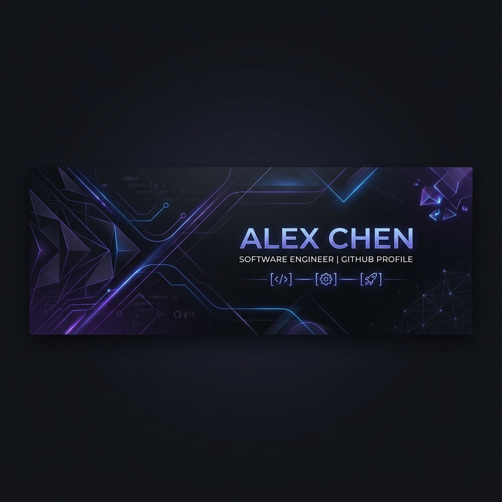

<div align="center">

<!-- PREMIUM HEADER -->


<br/>

<!-- DYNAMIC SUBTITLE -->


<br/>

<!-- CONNECT -->
<a href="https://www.linkedin.com/in/osmancan-altinkaynak"></a>
<a href="mailto:osmancann25@gmail.com"></a>
<a href="https://github.com/osmanncan"></a>

<br/><br/>

---

## 🛠️ THE ENGINEERING STACK

<br/>

<table align="center" border="0" cellpadding="10">
  <tr>
    <td align="center" valign="top" width="33%">
      <b>CORE DEVELOPMENT</b><br/><br/>
      <br/>
      
    </td>
    <td align="center" valign="top" width="33%">
      <b>BACKEND & INFRA</b><br/><br/>
      <br/>
      
    </td>
    <td align="center" valign="top" width="33%">
      <b>DESIGN & PRODUCT</b><br/><br/>
      <br/>
      
    </td>
  </tr>
</table>

<br/>

---

## 🏗️ SYSTEM ARCHITECTURE & DESIGN

> I don't just build UI; I engineer end-to-end ecosystems optimized for performance, security, and offline reliability.

<br/>

<div align="center">

</div>

<br/>

<table align="center">
  <tr>
    <td width="50%">
      <h3>🛡️ Security & Scalability</h3>
      <ul>
        <li><b>Asymmetric Auth:</b> Implementing secure deep-link authentication.</li>
        <li><b>PostgreSQL RLS:</b> Ensuring absolute data isolation at the database level.</li>
        <li><b>Serverless Edge:</b> Offloading critical logic to Deno Edge Functions.</li>
      </ul>
    </td>
    <td width="50%">
      <h3>💾 Performance & UX</h3>
      <ul>
        <li><b>Offline-First:</b> Persistent local cache with Zustand & AsyncStorage.</li>
        <li><b>60FPS Animations:</b> High-performance motion with Reanimated.</li>
        <li><b>Resource Optimization:</b> Minimizing cloud costs via smart caching.</li>
      </ul>
    </td>
  </tr>
</table>

<br/>

---

## 🚀 CURRENT PRODUCTION LOG

```zsh
$ system-status --report

[STATUS] Scanning repositories...
[INFO]   Active Project: High-performance mobile architecture with Expo
[INFO]   Current Focus: Serverless Edge Functions & AI Proxy layers
[INFO]   Security: Row Level Security (RLS) fully implemented
[OK]     All systems operational.
```

<br/>

---

## 📈 ENGINEERING METRICS

<div align="center">

</div>

<br/>

---

## 🤝 LET'S COLLABORATE

<p>I'm always looking for challenging projects that push the boundaries of mobile and web engineering.</p>

<a href="mailto:osmancann25@gmail.com">
  
</a>

<br/><br/>


</div>
